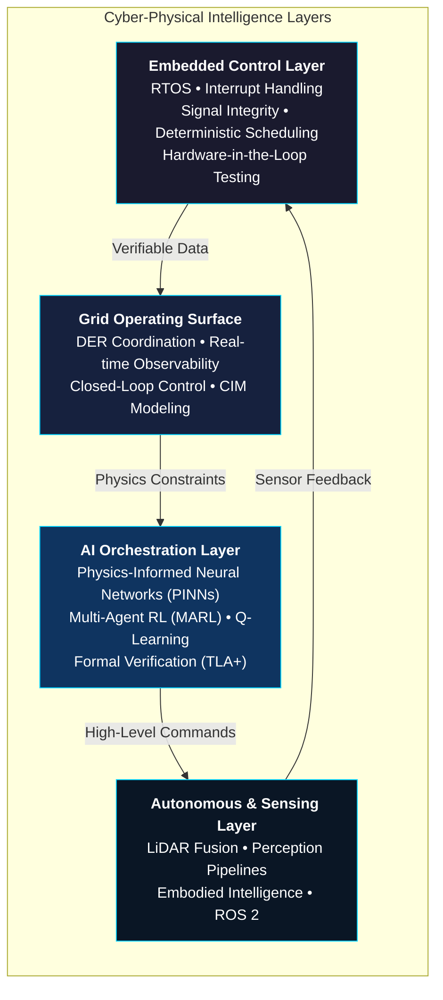

# 🚀 Vincenzo Grimaldi

**Physics-Informed Cyber-Physical Systems Engineer**  
*Designing deterministic, physics-informed intelligence that transforms complex control systems into operational, verifiable, and adaptive realities.*

[](https://vincenzo-grimaldi-portfolio.vercel.app/)
[](https://nextjs.org/)
[](https://www.typescriptlang.org/)
[](https://tailwindcss.com/)
[](https://github.com/iceccarelli)

---

> **"The portfolio website and this GitHub profile are two complementary surfaces of the same mission."**  
> — Vincenzo Grimaldi

---

## 📍 Global Operational Footprint

Vincenzo operates with a **global mindset** across critical time zones and infrastructure horizons:

| Location     | Time Zone          | Strategic Relevance                  |
|--------------|--------------------|--------------------------------------|
| **Toronto**  | EDT (UTC-4)       | Operational home base                |
| **New York** | EDT (UTC-4)       | Financial & energy markets           |
| **Lima**     | PET (UTC-5)       | Latin American grid & mining ops     |
| **Frankfurt**| CEST (UTC+2)      | European critical infrastructure     |
| **Beijing**  | CST (UTC+8)       | Asian manufacturing & EV supply chain|

*Real-time awareness of global energy, mobility, and cyber-physical systems.*

---

## 🧠 Philosophy & Mission

Vincenzo Grimaldi operates at the **intersection of embedded logic, real-time operating systems (RTOS), AI orchestration, and grid-scale infrastructure**.

His core belief:  
**Integrate AI, software, infrastructure, energy, and robotics** — not as isolated domains — but into **deterministic physics-informed systems** where every layer is verifiable, safety-critical, and deployable in the real world.

He translates high-stakes technical complexity into systems that are **predictable, legible, and trustworthy**.

---

## 🏗️ Architecture of Value Creation

This repository powers the live portfolio at [vincenzo-grimaldi-portfolio.vercel.app](https://vincenzo-grimaldi-portfolio.vercel.app/). It showcases a **layered cyber-physical intelligence stack**:



**Core Mathematical Foundation** (from flagship thesis work):

$$
L_{\text{total}} = L_{\text{data}} + \lambda L_{\text{physics}}
$$

where

$$
L_{\text{physics}} = \left\| \frac{\partial u}{\partial t} + \mathcal{N}[u] \right\|^2
$$

This ensures neural models respect the underlying physical laws — critical for safety-critical grid and control applications.

---

## ⚡ Tech Stack & Mastery

### Core Technologies
- **Languages**: TypeScript, Python
- **Framework**: Next.js 14 (App Router) + React 18 + Tailwind CSS 3.4
- **Styling & Animation**: Custom Tailwind + CSS-driven cinematic effects (lightweight, no heavy animation libraries in core bundle)
- **Deployment**: Vercel (edge-optimized, instant global delivery)

### Domain-Specific Expertise
| Category                    | Technologies & Standards                                                                 | Proficiency Focus |
|-----------------------------|------------------------------------------------------------------------------------------|-------------------|
| **Smart Grid & Energy**     | IEC 61850, CIM (Common Information Model), OCPP, SunSpec, DER coordination               | Expert            |
| **Cybersecurity & Resilience** | IEC 62351, NERC CIP, NIS2, EU CRA, ThreMA framework                                      | Expert            |
| **AI & Control Systems**    | Physics-Informed Neural Networks (PINNs), Reinforcement Learning (Q-Learning, MARL), Formal Verification (TLA+) | Advanced          |
| **Real-Time & Embedded**    | RTOS, Hardware-in-the-Loop (HIL), Interrupt Handling, Signal Integrity, Deterministic Scheduling | Advanced          |
| **Robotics & Perception**   | ROS 2, LiDAR Sensor Fusion, Perception Pipelines, Embodied Intelligence                  | Advanced          |
| **Infrastructure & Cloud**  | AWS Energy, Cloud-native architectures, HELICS co-simulation                             | Proficient        |

---

## 💼 Professional Journey

### Current Role
**Grid Networks Engineer – ITk Fachspezialist (Digitisation of High-Voltage Assets)**  
**DB InfraGO AG (Deutsche Bahn)** | Aug 2024 – Present | Frankfurt, Germany

- Leading digitalisation strategy for railway traction high-voltage grids
- Driving **IT/OT convergence** with KRITIS-compliant cybersecurity governance
- Resilience engineering for mission-critical rail infrastructure

### Previous Experience
**Industrial Engineering Intern – High-Voltage Maintenance**  
**DB Fahrzeuginstandhaltung GmbH & DB Netz AG** | Jun 2022 – Sep 2024

- Lifecycle management of traction power substations
- Asset condition monitoring and predictive maintenance systems
- Critical systems maintenance for Germany's largest rail operator

---

## 🚩 Flagship Systems & Projects

### 1. physics-informed (Master's Thesis Flagship)
**Production-grade interactive simulator** for cross-domain CIM + ThreMA ontology, physics-informed neural networks, RL security agents, and IEEE 9-Bus cyber-physical validation.

- **Thesis Title**: *Data Modeling in a Cross-domain Ontology for Cyber Intelligence in Smart-Grids Using Reinforcement Learning* (RWTH Aachen University, June 2025)
- **Key Innovations**:
  - First systematic integration of **Common Information Model (CIM)** with **ThreMA** cybersecurity framework
  - 5 Formal Semantic Mappings
  - 4 Documented Attack Scenarios with Cross-Domain SNR Metric
  - Validated on enhanced **IEEE 9-Bus** cyber testbed
- **Live Demo**: [physics-informed.vercel.app](https://physics-informed.vercel.app/)
- **Repository**: [github.com/iceccarelli/physics-informed](https://github.com/iceccarelli/physics-informed)
- **Impact**: Bridges academic research with operational smart-grid cyber defense

### 2. NeuralBridge
**AI-native middleware** for human-to-model orchestration in safety-critical physics-informed environments.

- Fuses high-level AI reasoning with low-level hardware constraints
- **Sub-8 ms deterministic latency** guarantees
- Enables trustworthy human-AI collaboration in control rooms and edge devices

### 3. GridOS
**Control-oriented operating surface** for smart-grid intelligence, DER coordination, and real-time observability.

- Digital command surface for closed-loop control of smart grids and distributed energy resource (DER) fleets
- Built for operators who need **verifiable, physics-aware decisions** at scale

### 4. DERIM
**Distributed Energy Resource Intelligence Middleware**

- Verifiable coordination and grid-aware execution
- Achieved **22% reduction in grid curtailment** via DERIM + Multi-Agent Reinforcement Learning (MARL)

### 5. Robot LiDAR Fusion
**Real-time perception and sensor fusion stack** bridging software intelligence with physical autonomy.

- Perception pipelines that translate raw sensor data into **verifiable physical actions**
- Foundation for embodied intelligence in robotics and autonomous systems

---

## 🎓 Education

**Master of Science (implied)**  
**RWTH Aachen University** | Matriculation No. 353970

- **Master’s Thesis** (June 2025): *Data Modeling in a Cross-domain Ontology for Cyber Intelligence in Smart-Grids Using Reinforcement Learning*
- Focus: Cross-domain ontology (CIM + ThreMA), Reinforcement Learning for cyber defense in critical infrastructure

---

## 📜 Professional Artifacts (Included in This Repo)

This repository also contains high-quality professional documents ready for applications and collaborations:

- `Vincenzo_Ceccarelli_Grimaldi_CV_ACS_SAFEr_Grid.pdf`
- `Vincenzo_Ceccarelli_Grimaldi_CV_TIM_SAFEr_Grid.pdf`
- `Vincenzo_Ceccarelli_Grimaldi_Motivation_Letter_ACS_SAFEr_Grid.pdf`
- `Vincenzo_Ceccarelli_Grimaldi_Motivation_Letter_TIM_SAFEr_Grid.pdf`
- High-resolution headshot: `vincenzo_grimaldi_headshot_best_for_profile.jpg`
- Footer branding image: `Vincenzo_Grimaldi_footer_picture_website.jpg`

---

## 🛠️ Developer Surface – Run Locally

This is the **complete source code** for the live portfolio.

```bash
# Clone the repository
git clone https://github.com/iceccarelli/vincenzo-grimaldi-portfolio.git
cd vincenzo-grimaldi-portfolio

# Install dependencies (lightweight core stack)
npm install

# Start the development server
npm run dev
```

Open [http://localhost:3000](http://localhost:3000) — experience the cinematic interface locally.

**Build for production:**
```bash
npm run build
npm start
```

**Tech Notes**:
- Next.js 14.2 App Router
- TypeScript strict mode
- Tailwind CSS with custom design tokens for technical credibility
- Optimized for Vercel deployment (zero-config)

---

## 🌐 Trusted Intelligence Ecosystem

Vincenzo continuously draws from and contributes to the world's leading sources of energy, AI, and infrastructure intelligence:

- **MIT Technology Review**
- **MIT Energy Initiative**
- **International Energy Agency (IEA)**
- **National Renewable Energy Laboratory (NREL)**
- **BloombergNEF**
- **AWS Energy**

---

## 📊 Quantified Impact & Differentiators

- **22%** reduction in grid curtailment (DERIM + MARL)
- **<8 ms** deterministic latency (NeuralBridge)
- **99.999%** uptime target for critical rail & grid systems
- **5** formal semantic mappings between CIM and ThreMA
- **4** fully documented cyber-physical attack scenarios validated on IEEE 9-Bus

---

## 🤝 Continue the Conversation

Vincenzo is open to high-signal collaborations in:
- Physics-informed AI for critical infrastructure
- Smart grid digitalization & cybersecurity
- Deterministic real-time systems
- Cross-domain ontology engineering
- Safety-critical robotics & autonomy

**Connect**:
- 🌐 **Live Portfolio**: [vincenzo-grimaldi-portfolio.vercel.app](https://vincenzo-grimaldi-portfolio.vercel.app/)
- 🐙 **GitHub**: [github.com/iceccarelli](https://github.com/iceccarelli)
- 📍 **Base**: Toronto / Global (Lima • New York • Frankfurt • Beijing)

---

## 📄 License

This repository is released under the **MIT License** (standard for personal portfolios — feel free to use the structure as inspiration, but please attribute the original work).

---

**Built with precision. Deployed with purpose.**  
*Last updated: May 2026*

---

<p align="center">
  <a href="https://vincenzo-grimaldi-portfolio.vercel.app/">
    
  </a>
</p>

<p align="center">
  <i>"Every layer must be verifiable. Every decision must be physics-informed. Every system must earn trust."</i>
</p>
